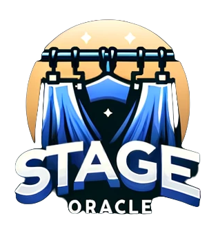

## Description
This is the backend for the Stage Oracle project. It contains two API:s that are used for the project.\
The Registration API is used for Performers to register their data and manage it.\
The Production API is used for the production team to manage the production data and import performers into it. \
Each of the API:s have their own My-SQL database and their own security solution issuing JWT tokens to users.

Link to the frontend:
https://github.com/Emilsivertsson/stage-oracle-front

## What was your motivation?
This is a part of my degree project for the course "Java integration" at Campus Mölndal. \
The project as whole is for Opera/theaters to manage their productions and performers. \
I wanted to use as many of the different technologies we have learned about in the course as possible.

# Installation
Important!\
if you don't have a local MySQL database running on your computer, the application will not start.\
you will get an error message that the application cant connect to the database.

1. To use the application you need to have a local MySQL database running on your computer.
    - Download MySQL Community from https://dev.mysql.com/downloads/installer/ and install it.
    - When you have installed MySQL Community you need to create two a databases called "productions" and "performers".
    - The application uses password "root" and username "root" to connect to a local MySQL database.
    - please alter the password and username in the application.properties file if yours not the same.

- You could also mount a Docker image of mySql, for help on how to do this please see the Docker homepage,\
  or this tutorial https://youtu.be/kphq2TsVRIs?si=wS20hxnnLG2CAxr4

2. You need to install Mailhog to be able to send emails from the application.
    - Easy way to install Mailhog is to use Docker.\
      Run the following command in your terminal:\
      `docker run -d -p 1025:1025 -p 8025:8025 mailhog/mailhog`
    - You can access the Mailhog web interface at localhost:8025 to see the emails that are sent from the application.
    - more info on Mailhog can be found at https://mailtrap.io/blog/mailhog-explained/#MailHog-features
   
3. Clone this repository to your computer and open it in your IDE.
   - run the applications
   - The applications will run on localhost:8080 and localhost:8081
   - The applications use HTTP requests to communicate with each other, so make sure you start them both.

### OR
You can run the applications in Docker.\
To do this you need to have Docker installed on your computer.\
run the following command in you terminal in the root folder of the project:\
`docker compose up`\
and wait until the applications are up and running.\
The applications will run on 8080, 8081 and 8081, 8025, 3000 and 3306.\
you cant have a local MySQL database running on your computer or else the applications will not start.\
when its up and running you can access the applications at localhost:3000 in your browser.\
to check the emails that are sent from the application you can access Mailhog at localhost:8025.

## Kubernetes
The applications can be run in Kubernetes.\
To do this you need to have a running Kubernetes cluster like Minikube for local development.\
You also need to have Kubectl installed on your computer.\
You can run the following commands in the kubernetes folder:
- `kubectl apply -f master-deployment.yaml`\
  This will create the deployments and services for the applications.
- `minikube service production-service`\
  To start the production-service tunnel and give outside access to the service.
- `minikube service registration-service`\
  To start the registration-service tunnel and give outside access to the service.\

you can then update the frontend with the new IP addresses of the services, since the frontend is not running in the cluster.

## Usage
The APIs are used by the frontend application to manage productions and performers.

## Third party credits
Thanks to ChatGpt, copilot and my rubber-ducks for helping when things got stuck.

## License
This project uses the following license: [MIT](https://opensource.org/licenses/MIT).

## Postman Documentation
In the Folder "Postman" you will find a collection of requests that can be used to test the API.\
Import the collection to Postman and run the requests starting with Login to get a JWT token. \
Use that to authenticate the other requests.

## Swagger Documentation
When the application is running you can access the Swagger documentation at:\
For Production-service: http://localhost:8080/swagger-ui.html \
For Registration-service: http://localhost:8081/swagger-ui.html 

## Features
As a Registered Performer you can:
- Register your profile
- Update your profile
- Delete your profile

As a Production team member you can:
- Perform CRUD operations on a production and its underlying structure with cast and acts
- Import performers to a production* from the Registration API
- Send Emails to performers
- see all your unfinished Garments

Both Api:s has Admin roles that can perform all operations, and CRUD operations on the users.

## Tests
Tests are done with TestContainers, junit and  RestAssured. The tests are run with Maven. \
To run them you must have a running DockerDaemon (Docker Desktop). \
and some patience , the tests take a while to run.
